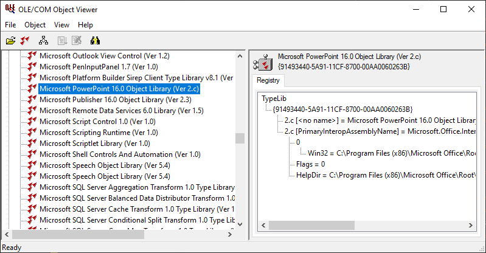

# ActiveQt Word Automation sample

I've found [this question](https://stackoverflow.com/questions/59747787/how-to-create-docx-and-doc-file-with-qaxobject-in-qt-for-windows) on StackOverflow requesting advice for creating a Word document from scratch (as opposed to opening / modifying) an existing one, from a Qt application. The user wants to use raw QAxObjects and dynamicCall() to do so, in line with [other answers](https://stackoverflow.com/questions/3177268/generating-word-documents-doc-odt-through-c-qt) on the same site, but I know that there is a better way of automating Office applications: importing the object model from the MS Word COM type library into the C++ project. This is a sample template of the proposal, that is very similar to the [Qutlook Example](https://doc.qt.io/qt-5/activeqt-activeqt-qutlook-example.html) for the Outlook application. You can extrapolate the technique to Excel and PowerPoint if you want.

It is a command line project with only two files: the Qmake project file and 'main.cpp'. The project file uses the utility [dumpcpp.exe](https://doc.qt.io/qt-5/activeqt-dumpcpp.html) to generate the header and source files from the type library.

    DUMPCPP=$$absolute_path("dumpcpp.exe", $$dirname(QMAKE_QMAKE))
    TYPELIBS = $$system($$DUMPCPP -getfile {00020905-0000-0000-C000-000000000046})

To obtain the Guid of a type library, you may want to use the ['oleview.exe' utility](https://docs.microsoft.com/en-us/windows/win32/com/ole-com-object-viewer) to explore the libraries installed in your Windows box.

The main() function #includes the generated header "MSWORD.h", creates a new document, populates its contents with two text lines, and saves this document twice: the first time in the modern DOCX format, and again in the DOC format compatible with Word 97/2003.
